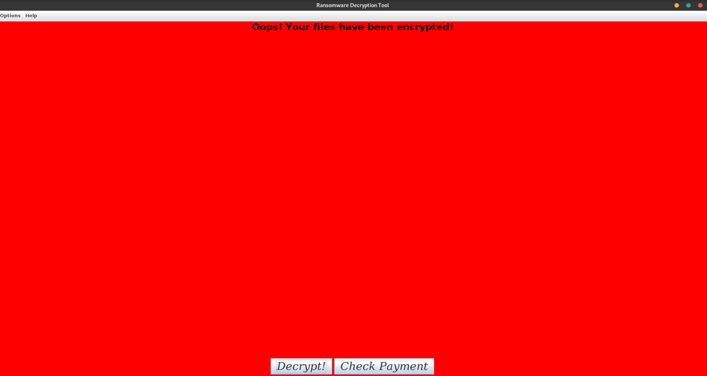
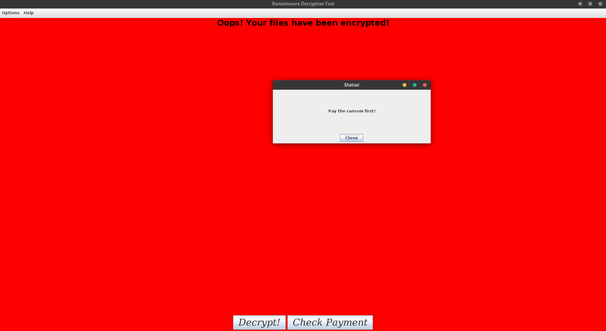

# JAVA based Ransomware

## Technicalities
1. There is a launcher GUI made in java which should be run by victim to decrypt his system.
2. We will be using psql database to store the random secret identifier key to identity the user and to automate the process on sending the AES encryption key once payment conformation is recieved.
3. We are using AES and RSA based hybrid encryption to encrypt the file system. Once encryted victim will be shipped with a launcher file which will only run on his system.
4. Randomly generated AES key of 50 character is used to encrtpt all the files and that AES key is then encrypted with the public key of MASTER RSA key pair and stored in key.enc file. Once user clicks decrypts button, a GET request will be made with content of key.enc and identifier which will be checked against payment status and if paid, the content will be then decrypted with the private Key of the server and plain AES key will be sent back to victim.
5. File id.enc is unique identifier for victim encpryted with the public key of MASTER RSA key pair to prevent someone missusing the identifier to already paid victim.
6. Files salt.enc and iv.enc are the part of enryption process. Files i.e id.enc,key.enc,salt.enc,iv.enc should not be deleted  by victim at any cost, in case he does so no one will be able to recover his files once encryted!

## Installation
Just run install.sh file and everything will be setup autmatically for you. Enjoy ! :)<br>You just have to make victim run encrypt.java and reset everything will be taken care of!

## Decryption GUI




**NOTE : By default it encrypts everything in /tmp/tmp folder! Change the code accordingly!**

## TODO
- [ ] Implement multithreaded encryption and decryption to get better performace.
- [ ] Keep copies of all DO NOT DELETE files in every directory to avoid getting doomed
- [ ] Copy the decryptor in each folder as a backup in case victim deletes one
- [ ] Enchance GUI with a analog timer and same in backend
- [ ] Scrap bitcoin wallet address to automatically update payment status once done!

## Compilation (Depricated)
Go to src/main directory and type below lines
```bash
javac -d ../class/main encrypt.java
javac -d ../class/launcher decrypt.java
cd ../launcher && javac -d ../class/launcher -cp ../class/launcher launcher.java
cd ../class && java 
```

#### Please Note : This is me trying to learn JAVA. Don't be a asshole use it anywhere. I am not responsible for your actions and choices.
