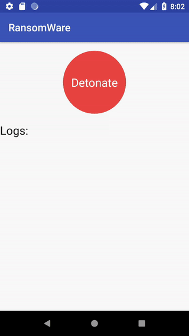

# Ransomware

This project was made during an cryptography introduction week during ours cursus at [ESGI](https://www.esgi.fr) school.

This project is split in two component:
* An Python Api which register, provide and store private/public keys of each devices
* An Android App which encrypt/decrypt data from phone

## Getting Started

These instructions will get you a copy of the project up and running on your local machine for development and testing purposes. See deployment for notes on how to deploy the project on a live system.

## API Python

#### Prerequisites

For use the project you must install python 3.X in your host or computer and lanch the command.


#### Installing

First you have to install the lib needed by the application

```
pip install -r requirements.txt
```


#### Launch the application

We can lanch the application in two mode :

1. Production
2. Development
3. Testing
4. Default (by default)

For launch the application :

```
python runserver.py
```

For launch with production environnment:
```
MODE=development python runserver.py
```

The keywords use in mode :
* production
* testing
* production
* default

#### Project strcuture

The project structre :

    ├── LICENSE.md
    ├── ransomware          # The flask application
    │   ├── __init__.py
    │   ├── config          # th folder contains the different config for each env
    │   │   ├── __init__.py
    │   │   └── config.py
    │   ├── models.py       # The schema of the database
    │   └── utils.py        # Some function use in the application
    ├── readme.md
    ├── requirements.txt
    └── runserver.py        # Script for run the flask application


#### Built With

* [Flaks](http://flask.pocoo.org/) - The api framework use
* [Pony](https://ponyorm.com/) - The orm use
* [Pycryptodome](http://pycryptodome.readthedocs.io/en/latest/index.html) - Used to generate RSA key
* [Sqlite](https://www.sqlite.org/index.html) - Database use

#### Doc Api :

* [Api doc](https://documenter.getpostman.com/view/587840/RW86MVrV)


## Android App

### Built With
* [Butter Knife](https://github.com/JakeWharton/butterknife) - Bind Android views and callbacks to fields and methods
* [google-gson](https://github.com/google/gson) - A Java serialization/deserialization library to convert Java Objects into JSON and back
* [Retrofit](https://github.com/square/retrofit) - Type-safe HTTP client for Android and Java


### Demo



## Authors

* [**Mohson BUTT**](https://github.com/Mohsan1995) - Api Server
* [**Quentin LEPRAT**](https://github.com/CrabeMan) - Android App


## License

This project is licensed under the MIT License - see the [LICENSE.md](LICENSE.md) file for details
